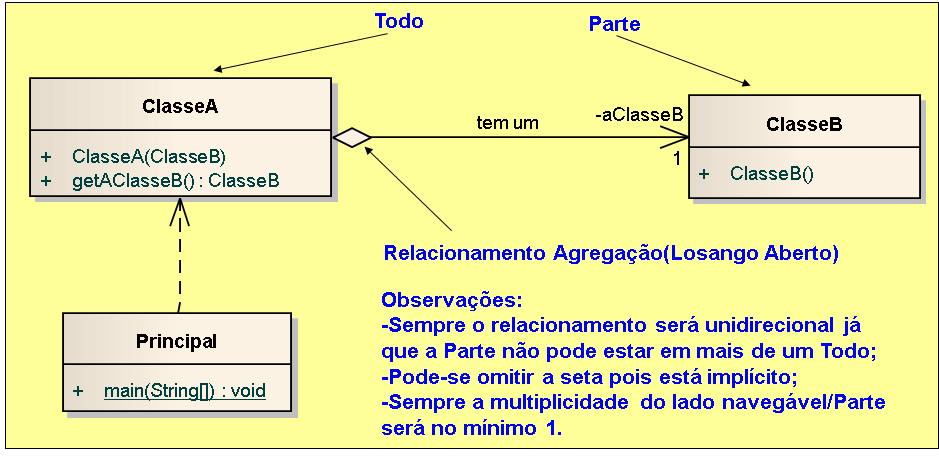

# Exemplo de implementação de relacionamento agregação em Java.

## Contextualização

- Programa em Java que demostra a implementação do relacionamento agregação "tem um". 
- Uma associação é uma conexão entre classes e representam as relações entre os objetos. 
- Agregação é uma pura associação entre duas classes representa um relacionamento estrutural entre pares, significando que essas duas classes estão conceitualmente em um mesmo nível, sem que uma seja mais importante do que a outra. 
- Em alguns casos, você desejará fazer a modelagem de um relacionamento “todo/parte”, no qual uma classe representa um item maior(“o todo”), formado por itens menores (“as partes”). 
- Representa um relacionamento do tipo “tem-um”, o que significa que um objeto do todo contém os objetos das partes. 
- A parte pode ser compartilhada com mais de um todo, portanto também é conhecida como Agregação Compartilhada(Shared). 
- Agregação é uma forma especializada de associação especificada utilizando-se uma associação simples com um losango aberto na extremidade do todo.  
    - Agregação é conhecido como um relacionamento de contenção ou “todo-parte”. 
    - Agregação: a “é parte essencial de” b 
- O projeto foi desenvolvido no NetBeans deve ser chamado relacionamento_uml_agregacao_java. 
- Utiliza o Apache Maven para a automatização da construção. 

## Diagrama

## Arquivo do projeto

O arquivo Modelo.EAP é o projetodo sistema utilizando ferramanta CASE Enterprise Arquitect.

## Outras arquivos
- pom.xml - Arquivo de configuração da ferramenta de automação Maven.
- *.bat - Arquivos de lote(Batch) de console para tarefas compilar, executar, documentar, empacotar e limpar o projeto.